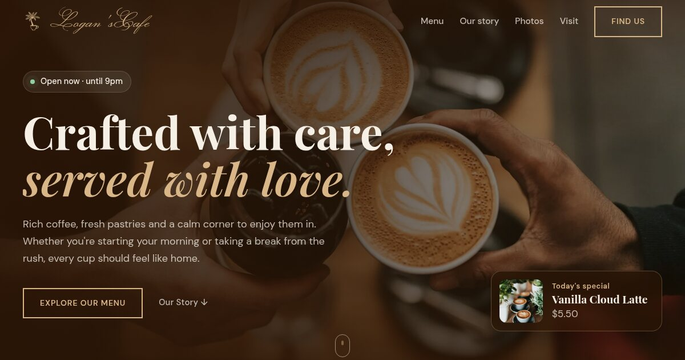

<div align="center">


# Logan'sCafe

### Crafted with care, served with love.

[](https://madebymyst.github.io/logans-cafe/)

</div>

> **This is a concept project.** Logan'sCafe isn't a real café. The menu, owner, quote, address and opening hours are demo content, made to show business website design.



A website for a made-up neighbourhood café, designed and built by [MadeByMyst](https://madebymyst.github.io/). It answers what a visitor wants to know, quickly: what's on the menu, what the place is like, and when it's open.

## What's on the page

- **Hero:** one warm photo, a live "Open now" status, today's special in the corner, and the original Logan'sCafe buttons
- **Menu:** coffee, cold drinks and pastries, laid out like a printed café menu with prices
- **Our story:** a few words from Logan, the (made-up) owner
- **A look inside:** four photos of the café
- **A word from a regular**
- **Visit:** address, opening hours and whether it's open right now

## Simple and fast on purpose

- Plain HTML, CSS and JavaScript. No frameworks, no build step.
- Every photo is stored locally as WebP and sized for the page.
- Works on phones, tablets and desktops, and respects "reduce motion" settings.
- Motion is quiet: the headline slides in, sections fade up, the original Logan'sCafe buttons fill with amber on hover.

## Files

| File | What it does |
|---|---|
| `index.html` | The page |
| `styles.css` | Design tokens at the top, then each section, written mobile-first |
| `script.js` | Mobile menu, gentle scroll effects and the opening-hours status |

To run it locally, open `index.html` in a browser, or serve the folder:

```bash
python3 -m http.server
```

## Credits

| Asset | Source |
|---|---|
| Photos | [Unsplash](https://unsplash.com/) |
| Fonts | Playfair Display, DM Sans and Monsieur La Doulaise from [Google Fonts](https://fonts.google.com/) |

---

<div align="center">

Made by **[MadeByMyst (Shahab MD)](https://madebymyst.github.io/)**, front-end developer based in Oman.

[](https://www.instagram.com/_mystiqdev72/)
[](https://www.linkedin.com/in/mystique-x-9572b93a7/)

</div>
